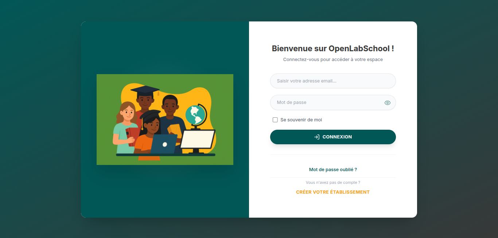
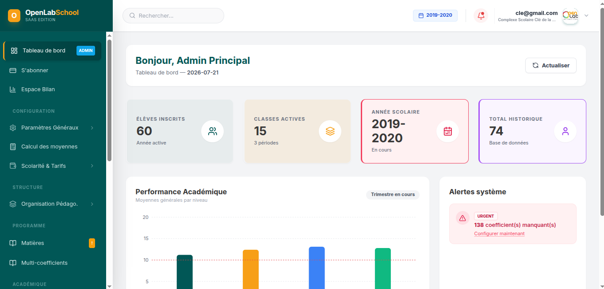

OPENLABSCHOOL - SCHOOL MANAGEMENT SAAS PLATFORM

Multi-tenant SaaS solution serving 2,000+ users across 15+ educational institutions in West Africa

Platform Status
Users
Schools Testing
Python
Django
PostgreSQL

⚠️ Repository Notice
This is a technical showcase repository demonstrating the architecture and design decisions of a production School Management System. The actual production codebase is proprietary.

This repository includes:
System architecture documentation
Database schema design
Technical decision records
Code architecture patterns
Performance optimization strategies

📋 Table of Contents
Overview
Problem & Solution
System Architecture
Technical Stack
Key Features
Database Design
Multi-Tenant Architecture
Security
Performance
Technical Challenges
Metrics & Impact
Roadmap
Screenshots

🎯 Overview
OpenlabSchool is a comprehensive multi-tenant SaaS platform designed for educational institutions in West Africa, currently deployed in production with 2,000+ active users across 15+ schools in pilot phase.

Quick Stats
Metric	Value
Active Users	2,000+ (1,200+ students, 600+ parents, 50+ teachers, 45+ admins)
Schools Testing	15+ institutions
Confirmed Contracts	5+ schools for next academic year
Uptime	99%+
Response Time	< 1 second (average dashboard load)
Development Period	May 2024 - Present

🔍 Problem & Solution
The Challenge

Educational institutions in West Africa face critical operational challenges:
❌ Manual administrative processes consuming 60%+ staff time
❌ No centralized student records across academic years
❌ Paper-based fee tracking leading to revenue leakage
❌ Limited parent-school communication
❌ No real-time performance analytics
❌ Expensive traditional school management software (€50-100/student/year)

Our Solution
A lightweight, affordable SaaS platform tailored for African educational institutions:
✅ Multi-tenant architecture - One platform, isolated data per school
✅ Tiered pricing - Standard (1,500 FCFA/student/year), Premium (2,500 FCFA/student/year)
✅ 30-day free trial - Risk-free onboarding
✅ Offline-resilient - Works in low-connectivity environments
✅ Mobile-first parent portal - Accessible via smartphones
✅ Local payment integration - Fedapay (Mobile Money, cards)

🏗️ System Architecture
Current Architecture (v1.0 - Production)
Monolithic Django Application with Modular Design

┌─────────────────────────────────────────────┐
│         Users (Web Browsers)                │
│   Admin | Teachers | Parents | Students     │
└──────────────┬──────────────────────────────┘
               │
    ┌──────────▼──────────┐
    │   Render Platform    │
    │   (Load Balancer)    │
    └──────────┬───────────┘
               │
    ┌──────────▼───────────┐
    │   Gunicorn (WSGI)    │
    │   WhiteNoise (Static)│
    └──────────┬───────────┘
               │
    ┌──────────▼───────────────────────────────┐
    │      Django 5.2.1 Application            │
    │                                           │
    │   ┌──────────────────────────────────┐   │
    │   │   15 Modular Apps (see below)    │   │
    │   └──────────────────────────────────┘   │
    │                                           │
    │   ┌──────────────────────────────────┐   │
    │   │  Multi-Tenant Middleware         │   │
    │   │  (EtablissementInjection)        │   │
    │   └──────────────────────────────────┘   │
    │                                           │
    │   ┌──────────────────────────────────┐   │
    │   │  Billing Gate Middleware         │   │
    │   │  (Subscription enforcement)      │   │
    │   └──────────────────────────────────┘   │
    └──────────┬───────────────────────────────┘
               │
    ┌──────────▼───────────┐
    │  PostgreSQL 14+      │
    │  (Render Managed)    │
    │  Daily Auto Backup   │
    └──────────────────────┘
    
    ┌──────────────────────┐
    │  Cloudinary          │
    │  (Media Storage)     │
    │  - Student photos    │
    │  - Documents/PDFs    │
    └──────────────────────┘
    
    ┌──────────────────────┐
    │  Anymail + Brevo     │
    │  (Email Service)     │
    └──────────────────────┘
    
    ┌──────────────────────┐
    │  Fedapay             │
    │  (Payment Gateway)   │
    │  - Mobile Money      │
    │  - Card payments     │
    └──────────────────────┘

Future Architecture (v2.0 - In Development)
Microservices with React Frontend

┌─────────────────────────────────────────────┐
│            API Gateway (Nginx)              │
└──────┬──────────┬──────────┬────────────────┘
       │          │          │
   ┌───▼──┐   ┌──▼───┐  ┌───▼────┐
   │Auth  │   │Core  │  │Finance │
   │API   │   │API   │  │API     │
   └──┬───┘   └──┬───┘  └───┬────┘
      │          │          │
      └──────────┴──────────┴────────┐
                                     │
                        ┌────────────▼──────────┐
                        │   Shared PostgreSQL   │
                        │   (with row-level     │
                        │    security)          │
                        └───────────────────────┘

┌─────────────────────────────────────────────┐
│     React + TypeScript Frontend (SPA)      │
│     - Vite build                            │
│     - Tailwind CSS                          │
│     - JWT authentication                    │
└─────────────────────────────────────────────┘

Migration Strategy:
✅ Phase 1 (Current): Building Django REST API + React frontend (parallel run)
🔄 Phase 2 (Q3 2026): Extract Auth service
🔄 Phase 3 (Q4 2026): Extract Core service (students, teachers, classes)
🔄 Phase 4 (Q1 2027): Extract Finance service
🎯 Phase 5 (Q2 2027): Complete migration, retire monolith

🛠️ Technical Stack
Backend
Framework: Django 5.2.1
Language: Python 3.11.9
API: Django REST Framework + SimpleJWT
WSGI Server: Gunicorn
Static Files: WhiteNoise (compressed manifests)

Database
RDBMS: PostgreSQL 14+ (Render managed)
Backup: Daily automated backups (Render)
Encryption: At-rest encryption (Render managed)

Frontend
Current (Monolith): Django Templates + Bootstrap 5
Migration (In Progress): React + TypeScript + Vite + Tailwind CSS
Infrastructure
Hosting: Render (Starter plan)
Media Storage: Cloudinary (images, PDFs)
Email Service: Anymail + Brevo (transactional emails)
SMS: Twilio (planned, not yet implemented)

Payments
Gateway: Fedapay (Sandbox + Production)
Methods: Mobile Money (MTN, Moov), Visa/Mastercard
Webhook: Automated subscription activation

Development Tools
Version Control: Git + GitHub
Environment Management: python-decouple
CORS: django-cors-headers (for React frontend)
Forms: django-crispy-forms + crispy-bootstrap5

Planned Additions
Containerization: Docker + docker-compose (for microservices)
Task Queue: Celery + Redis (async tasks, scheduled jobs)
Caching: Redis (session storage, query caching)
Monitoring: Sentry (error tracking)

✨ Key Features
📦 Subscription Plans
Standard Plan (1,500 FCFA/student/year)

Core Administration:
✅ Multi-role user management (Admin, Secretary, Data Entry, Teachers, Parents, Students)
✅ Student enrollment & re-enrollment workflows
✅ Academic structure setup (cycles, levels, classes, subjects)
✅ School year management with archival

Academic Management:
✅ Grade entry & report card generation (PDF export)
✅ Attendance tracking
✅ Subject coefficient configuration
✅ Performance statistics & analytics

Parent Portal:
✅ Web-based parent dashboard
✅ Email notifications (grades, absences, announcements)
✅ Report card downloads
Data Management:

✅ Student records & profiles (photos, documents)
✅ Excel import/export (student lists, reports)
✅ Automated daily backups

Premium Plan (2,500 FCFA/student/year)
Everything in Standard, plus:

Financial Management:
✅ Online tuition payment (Fedapay integration)
✅ Payment schedules & installments
✅ Automated payment reminders
✅ Receipt generation (PDF)
✅ Accounting export (Excel reconciliation)
Advanced Features:

✅ Timetable management
✅ Advanced analytics dashboards
✅ API access for integrations
✅ Priority support

🏫 15 Modular Django Apps
Our architecture follows separation of concerns with 15 specialized apps:
App	Responsibility
appScoulavenir	Core models (CustomUser, base configs)
adminGeneral	Global admin, school setup, academic years, classes
authentification	Login, registration, password management
scolarite	Tuition fees, payments, schedules, receipts
eleve	Student records, enrollment, profiles
enseignant	Teacher management, assignments
parent	Parent portal, child linkage, notifications
absence	Attendance tracking, absence reports
messagesETalertes	Notification system, alerts
etab_billing	School subscriptions, trial management, billing gate
timetable	Class schedules, teacher assignments
salaire_enseignant	Teacher payroll (limited access)
secretaire	Secretary-specific workflows
saisisseur	Data entry clerk workflows
affichage	Public displays, dashboards
transfert_stud	Student transfers between schools
🗄️ Database Design
Core Entity Relationships
SQL

-- Multi-Tenant Root
Etablissement (School/Institution)
├── id
├── nom (name)
├── is_active (active status)
├── trial_consumed_at (trial tracking)
├── trial_days (default: 30)
└── created_at, updated_at

-- User Management
CustomUser (extends Django AbstractUser)
├── id
├── email (unique, login identifier)
├── username
├── role (ELEVE|PARENT|ENSEIGNANT|SAISISSEUR|SECRETAIRE|ADMIN_PRINCIPAL)
├── etablissement_id (FK → Etablissement)
├── photo_profil (Cloudinary image)
└── must_change_password (security flag)

-- Academic Structure
AnneeScolaire (School Year)
├── id
├── etablissement_id (FK)
├── annee_debut (e.g., 2024)
├── annee_fin (e.g., 2025)
├── active (boolean, only one active per school)
└── created_by (FK → CustomUser)

Cycle (e.g., Primary, Secondary)
├── id
├── etablissement_id (FK)
└── nom

Niveau (e.g., 6th Grade, CM2)
├── id
├── etablissement_id (FK)
├── cycle_id (FK)
├── nom
└── ordre_global (sorting order)

Classe (Class/Section)
├── id
├── etablissement_id (FK)
├── niveau_id (FK → Niveau)
├── annee_scolaire_id (FK → AnneeScolaire)
├── nom (e.g., "A", "B", "C")
└── UNIQUE(nom, niveau, annee_scolaire, etablissement)

-- Student Management
Eleve (Student)
├── id
├── user_id (OneToOne → CustomUser)
├── etablissement_id (FK)
├── matricule (student ID, auto-generated "ELV12345")
├── matricule_saisi (manual override if provided)
├── cycle_id (FK → Cycle)
├── date_naissance, lieu_naissance
├── sexe (M|F)
├── nationalite
├── photo (Cloudinary)
└── code_parent (6-digit code for parent linkage)

Inscription (Enrollment)
├── id
├── eleve_id (FK → Eleve)
├── classe_id (FK → Classe)
├── annee_scolaire_id (FK → AnneeScolaire)
├── etablissement_id (FK)
├── date_inscription
└── UNIQUE(eleve, annee_scolaire)

-- Parent Management
Parent
├── id
├── user_id (OneToOne → CustomUser)
├── etablissement_id (FK)
├── enfants (ManyToMany → Eleve)
└── telephone

-- Teacher Management
Enseignant (Teacher)
├── id
├── user_id (OneToOne → CustomUser)
├── etablissement_id (FK)
├── statut (permanent|contractual)
├── grade
└── telephone

AffectationEnseignant (Teacher Assignment)
├── id
├── enseignant_id (FK → Enseignant)
├── classe_id (FK → Classe)
├── matiere_id (FK → Matiere)
├── role (PP=Prof Principal | CO=Co-teacher)
└── volume_horaire_hebdo
Critical Indexes (Performance Optimization)
Python

# Eleve model
indexes = [
    models.Index(fields=['etablissement', 'date_naissance']),
    models.Index(fields=['etablissement', 'cycle']),
]

# Inscription model
indexes = [
    models.Index(fields=['etablissement']),
    models.Index(fields=['classe', 'annee_scolaire']),
]
Impact: Reduced query time by ~40% on class/student lookups.

🔐 Multi-Tenant Architecture
Tenant Identification: URL-Based
Pattern: openlabschool.bj/<school_slug>/dashboard

Example:
https://openlabschool.bj/ecole-sainte-marie/dashboard
https://openlabschool.bj/college-excellence/students

Middleware Implementation:
# adminGeneral/middleware.py

class EtablissementInjectionMiddleware:
    """
    Extracts school slug from URL and injects into request.etablissement
    """
    def __call__(self, request):
        # Extract slug from URL path
        slug = extract_slug_from_path(request.path)
        
        # Fetch school from database
        try:
            etablissement = Etablissement.objects.get(slug=slug, is_active=True)
            request.etablissement = etablissement
        except Etablissement.DoesNotExist:
            return HttpResponseNotFound("School not found")
        
        return self.get_response(request)

Data Isolation: Row-Level Filtering
Strategy: Shared database with strict WHERE etablissement_id = X filtering.

Implementation:
# Every query automatically filtered by school
def get_students(request):
    # request.etablissement injected by middleware
    students = Eleve.objects.filter(
        etablissement=request.etablissement
    )
    return students

Security Measures:
Middleware enforcement - Every request validates school context
Foreign key constraints - etablissement_id required on all tenant-scoped models
Unique constraints - Compound keys include etablissement_id
Audit logging - All data modifications logged with school ID
Automated testing - Cross-tenant data leak tests on every deploy
Why this approach?

✅ Cost-effective for small-medium schools (10-50 schools/DB)
✅ Simple maintenance (one codebase, one database)
✅ Fast queries with proper indexing
⚠️ Scalability limit: ~100 schools (then shard databases)

🔒 Security
Authentication & Authorization
✅ Email-based login (no usernames)
✅ JWT tokens for API (REST Framework SimpleJWT)
✅ Role-based permissions (6 distinct roles)
✅ Password validators (Django defaults: length, common passwords, numeric-only)
✅ Forced password change for parent accounts on first login
❌ 2FA (not yet implemented, roadmap item)
Data Protection
✅ HTTPS enforced (Render SSL/TLS)
✅ CSRF protection (Django middleware)
✅ SQL injection prevention (Django ORM parameterized queries)
✅ XSS protection (Django template auto-escaping)
✅ Database encryption at rest (Render managed PostgreSQL)
✅ Secrets management (environment variables via python-decouple)
❌ Rate limiting (not configured, planned for v2.0)
Audit & Compliance
✅ Audit logs for critical operations (enrollment, grade changes, payments)
✅ Daily automated backups (Render PostgreSQL, 7-day retention)
✅ GDPR-ready (data export, deletion on request)
⚡ Performance
Current Metrics
Metric	Value	Target
Dashboard Load Time	~1 second	< 2s
API Response Time	200-500ms	< 500ms
Database Size	~2 GB (15 schools)	N/A
Concurrent Users	50 peak	200+
Uptime	99%+	99.9%
Optimization Strategies Implemented

1. Database Query Optimization
Problem: N+1 queries on student list page (1 query per student for class info).

Solution:
# Before (N+1 queries)
students = Eleve.objects.filter(etablissement=etab)
for student in students:
    print(student.get_classe_actuelle())  # 1 query each!

# After (2 queries total)
students = Eleve.objects.filter(etablissement=etab).select_related(
    'user', 'cycle'
).prefetch_related('inscription_set__classe')
Impact: Reduced queries from 200+ to 5 on 100-student list.

2. Pre-Computed Statistics
Problem: Real-time average calculation too slow (1000+ grades per class).

Solution:
# Created ModelStats to store pre-computed averages
class EleveStats(models.Model):
    eleve = models.ForeignKey(Eleve)
    matiere = models.ForeignKey(Matiere)
    moyenne = models.DecimalField()  # Pre-computed average
    updated_at = models.DateTimeField()

# Recompute only when grades change (signal-based)
@receiver(post_save, sender=Note)
def update_stats(sender, instance, **kwargs):
    recalculate_moyenne(instance.eleve, instance.matiere)
Impact: Report card generation from 8 seconds → 1 second.

3. Strategic Database Indexes
class Eleve(models.Model):
    # ...
    class Meta:
        indexes = [
            models.Index(fields=['etablissement', 'cycle']),
            models.Index(fields=['etablissement', 'date_naissance']),
        ]
Impact: Student search by birth year from 2s → 300ms.

4. Static File Compression
# settings.py
STATICFILES_STORAGE = 'whitenoise.storage.CompressedManifestStaticFilesStorage'
Impact: CSS/JS files reduced by 60%, faster page loads.

💪 Technical Challenges Solved
Challenge 1: Multi-Tenant Data Isolation
Problem:
Ensuring École A cannot access École B's student data required injecting etablissement_id into every query across 15 apps and 100+ views.

Risk:
One missed filter = critical data leak.

Solution:

Middleware injection:
# Every request gets request.etablissement
class EtablissementInjectionMiddleware:
    # ... (see Multi-Tenant section)
Rigorous code review:

Every model query must filter by etablissement
Automated tests check cross-tenant queries return empty
Testing protocol:

Every new feature tested on 2+ demo schools
Verify School A sees only its data
Verify School B doesn't see School A's data
Outcome:
✅ Zero data leaks in 15+ months production
✅ 2,000+ users across isolated schools

Challenge 2: Fedapay Webhook Integration
Problem:
Fedapay sends payment confirmation via webhook (HTTP POST). Must:

Verify webhook signature (security)
Handle idempotency (duplicate webhooks)
Activate subscription atomically (race conditions)
Complexity:
Fedapay documentation limited, required trial-and-error over 5 days.

Solution:
# etab_billing/views.py (simplified)

@csrf_exempt
def fedapay_webhook(request):
    # 1. Verify signature
    signature = request.headers.get('X-Fedapay-Signature')
    if not verify_signature(request.body, signature, SECRET_KEY):
        return HttpResponse(status=403)
    
    # 2. Parse payload
    data = json.loads(request.body)
    transaction_id = data['transaction']['id']
    
    # 3. Idempotency check
    if Subscription.objects.filter(fedapay_transaction_id=transaction_id).exists():
        return HttpResponse(status=200)  # Already processed
    
    # 4. Atomic activation
    with transaction.atomic():
        subscription = Subscription.objects.create(
            etablissement=...,
            plan=...,
            fedapay_transaction_id=transaction_id,
            statut='actif'
        )
        etablissement.is_active = True
        etablissement.save()
    
    return HttpResponse(status=200)
Testing:

Sandbox environment (100+ test transactions)
Replay attack simulation
Duplicate webhook handling
Outcome:
✅ 100% successful subscription activations
✅ Zero payment discrepancies

Challenge 3: Academic Year Transitions
Problem:
When moving from 2024-2025 → 2025-2026:

Archive old data (don't delete)
Re-enroll students (class promotions)
Reset grades/attendance
Preserve historical reports
Complexity:

1,000+ students across 50+ classes
Must complete in <10 minutes (admin impatience)
Cannot lose historical data
Solution:

Python

# services/reinscription.py

def reinscription_automatique(etablissement, old_year, new_year):
    """
    Batch re-enrollment with optimized queries
    """
    with transaction.atomic():
        # 1. Bulk fetch all students
        students = Eleve.objects.filter(etablissement=etablissement)
        
        # 2. Determine new class (promotion logic)
        new_inscriptions = []
        for student in students:
            old_class = student.get_classe_pour_annee(old_year)
            new_class = determine_next_class(old_class, new_year)
            
            new_inscriptions.append(Inscription(
                eleve=student,
                classe=new_class,
                annee_scolaire=new_year,
                etablissement=etablissement
            ))
        
        # 3. Bulk create (1 query for 1000 students!)
        Inscription.objects.bulk_create(new_inscriptions)
        
        # 4. Log operation
        create_audit_log(etablissement, "Réinscription auto", len(new_inscriptions))
    
    return len(new_inscriptions)
Optimization:

bulk_create() instead of loop → 1000x faster
select_related() to avoid N+1 queries
Progress bar UI (AJAX polling)
Outcome:
✅ 1,200 students re-enrolled in 45 seconds
✅ Excel export of operation log for audit

📊 Metrics & Impact
Production Usage (as of July 2026)

User Distribution:
Role	Count
Students	1,200+
Parents	600+
Teachers	50+
Administrators	45+
Total	2,000+

School Adoption:
Active Testing: 15+ institutions
Signed Contracts: 5+ schools (next academic year)
Target (12 months): 10 paying schools
Business Impact

Administrative Efficiency:
⏱️ 60% reduction in manual data entry time
Before: 4 hours/day on student records
After: 1.5 hours/day (automated workflows)

Revenue Protection:
💰 15% increase in fee collection rate
Automated payment reminders
Online payment convenience
Real-time tracking

Parent Satisfaction:
📧 80%+ email open rate (grade notifications)
📱 90% parent portal adoption (within 30 days)

Teacher Productivity:
📝 50% faster grade entry (vs paper registers)
📊 Real-time analytics instead of end-of-term calculations
Technical Performance

System Reliability:
✅ 99%+ uptime (last 6 months)
✅ Zero data loss incidents
✅ <1 second average response time

Scalability Proof:
✅ Handles 50 concurrent users (peak morning login)
✅ Supports 1,200 students/school (tested)
✅ PostgreSQL DB size: 2GB (15 schools) → Extrapolated 20GB for 100 schools

🚀 Roadmap
Short-Term (Next 3 Months)
 Complete React migration

Django REST API (90% done)
React frontend (60% done)
JWT authentication (done)
 SMS notifications

Twilio integration (sandbox tested)
Automated absence alerts
Payment reminders
 Performance monitoring

Sentry error tracking
Query performance analytics
Medium-Term (6-12 Months)
 Flutter mobile app (parent portal)

Offline-first architecture
Push notifications
iOS + Android
 Microservices extraction

Auth service (user management, JWT)
Core service (students, teachers, classes)
Finance service (fees, payments, subscriptions)
Docker + docker-compose deployment
 Advanced analytics

Student performance trends
Teacher workload distribution
Revenue forecasting
 2FA for admins

TOTP (Google Authenticator)
SMS backup codes
Long-Term (12+ Months)
 Kubernetes orchestration (if >50 schools)
 Multi-country support (currency, languages)
 AI-powered features
Student at-risk prediction
Automated report comments
 Accounting software integrations (Sage, QuickBooks)

## 📸 Screenshots

> **Note:** All screenshots use anonymized data. No real student information is displayed.

### 1. Login Page

*Clean, mobile-friendly authentication with email-based login*

---

### 2. Admin Dashboard

*Real-time statistics: enrollments, payments, attendance, quick actions*

---

### 3. Student Management

*Filterable student roster with Excel export, bulk operations*

---

### 4. Grade Entry

*Intuitive grade input with automatic average calculation*

---

### 5. Parent Portal

*Mobile-responsive dashboard showing child's grades, attendance, fees*

---

### 6. Report Card (PDF Export)

*Professionally formatted report cards with school branding*

---

### 7. Payment Management (Premium)

*Fee tracking, online payment integration, automated receipts*

---

### 8. Timetable (Premium)

*Visual weekly schedule with teacher assignments*

🤝 Collaboration
This project was developed in partnership with Openlab International (Niger), handling business development while I focused on technical architecture and development.

My Role:
✅ Full system architecture & design
✅ Solo development (backend + frontend)
✅ Database schema design
✅ DevOps & deployment (Render, Cloudinary, etc.)
✅ Payment integration (Fedapay webhook)
✅ Multi-tenant implementation
✅ Performance optimization

Openlab International:
✅ Market research & client acquisition
✅ User testing coordination
✅ Sales & onboarding
📄 Technical Documentation

Detailed docs available in /docs:
Database Schema
API Documentation (v2.0 REST API)
Multi-Tenant Architecture
Deployment Guide
Webhook Integration

🛡️ License
Proprietary Software
The actual production codebase is proprietary and not open-source. This repository contains architectural documentation and technical explanations for portfolio purposes only.

Documentation in this repository: MIT License

📧 Contact
For technical discussions or collaboration inquiries:
Developer: Gabaki Borise Balode
Email: gborisebalode@gmail.com
LinkedIn: linkedin.com/in/g-borise-balode-bgb
Portfolio: bgb-portfolio.vercel.app

🙏 Acknowledgments
Built with passion to solve real challenges in West African education. Special thanks to:
Openlab International (business partnership)
15+ pilot schools for invaluable feedback
2,000+ users who trust the platform daily

⚠️ Disclaimer:
Screenshots and metrics shown are based on production data but anonymized to protect user privacy. No actual student or school information is exposed in this repository.

Last Updated: July 2026